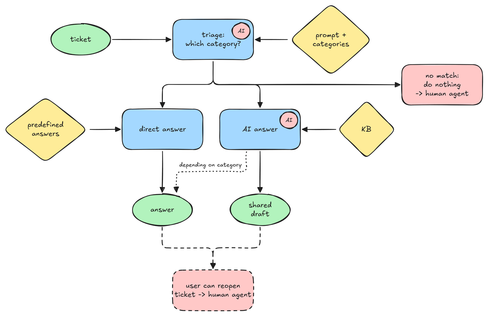

# ADR 02: Two-way processing of tickets

| Status   | accepted             |
| -------- | -------------------- |
| Author   | @freinold            |
| Voters   | @lenabMUC, @freinold |
| Drafted  | 2025-10-27           |
| Accepted | 2026-11-07           |

related to:

- [ADR 01: System Architecture](01-system-architecture.md)

## Context and Problem Statement

We have different needs for processing tickets with AI assistance in Zammad.
On the one side, we want to operate as automated as possible and send responses directly to customers.
On the other side, we want to be sure we don't send wrong or inappropriate responses.
Thus, we need to decide how to handle the two-way processing of tickets:

1. Fully automated processing: The AI generates responses and sends them directly to customers without human intervention.
2. Semi-automated processing: The AI generates draft responses that are reviewed and approved by human agents before being sent to customers.

## Proposed Workflow

We propose the following workflow to handle both fully automated and semi-automated processing of tickets:

- **1**: Triage: When a new ticket is created, we first triage the ticket to determine its category based on predefined criteria by using a system prompt and structured output.
- **2a**: Fully Automated Processing: For tickets that fall into categories deemed safe for automation (e.g., common inquiries, FAQs), we respond with a predefined answer directly to the customer. The ticket will be auto-closed after a specified period (e.g. 14 days) if there is no customer response.
- **2b**: Semi-Automated Processing: For more complex or context-sensitive tickets, we generate a draft response using a GenAI model and provide context from a knowledge base or external tools. This draft will then be reviewed and approved by a human agent before being sent to the customer.
- **2c**: If the triage cannot determine the category with sufficient confidence, the ticket will be routed to a human agent for manual processing.
- **3**: Optional: If the customer responds to the ticket due to wrong processing or other reasons, the ticket will be handled by a human agent.

Additionally, we can define specific categories where an AI answer could be auto-sent after we have evaluated the performance over time.

## Decision Made

tbd
